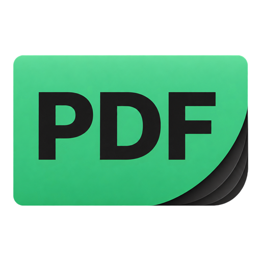

<h1 align="center">SumatraPDF Enhanced</h1>

<strong>Read, annotate and learn in one place.</strong> A Windows document reader built on official SumatraPDF, with a Pretty-style native interface, richer pen tools and offline vocabulary learning.

  
  
  
  

<a href="#overview">Overview</a> · <a href="#download">Download</a> · <a href="#features">Features</a> · <a href="#get-started">Get started</a> · <a href="#upstream">Upstream source</a> · <a href="#development">Development</a> · <a href="#support">Support</a>

---

## 🚀 Overview

Keep SumatraPDF's document-reading foundation and add tools for studying, writing and presentation. Open PDF, EPUB, MOBI, CBZ, CBR, FB2, CHM, XPS and DjVu documents, customize the reading interface, annotate PDFs and build your vocabulary as you read.

<table>
<tr>
<td width="33%" valign="top"><h3>📚 Read and organize</h3>
Search recent documents, resume reading and choose themes, fonts and interface sizes.
</td>
<td width="33%" valign="top"><h3>✍️ Write and present</h3>
Choose pen profiles, pin annotation presets and use a temporary laser pointer.
</td>
<td width="33%" valign="top"><h3>🧠 Learn offline</h3>
Look up words with Shift+D, save vocabulary and practice with six learning activities.
</td>
</tr>
</table>

### ✨ What Enhanced adds

| Area            | Enhanced additions                                                           | Retained upstream foundation                |
| --------------- | ---------------------------------------------------------------------------- | ------------------------------------------- |
| 📖 Dictionary   | Embedded offline definitions, vocabulary lists and study packs               | Document reading, text selection and search |
| 🎓 Learning     | Flashcards, quizzes, spelling, word scramble, matching and review scheduling | Reading positions and document navigation   |
| 🖊️ Annotation   | Pen profiles, pinned color and width presets and fractional-width controls   | Native PDF annotations and saving           |
| 🔦 Presentation | Temporary laser with solid, hollow and dot styles                            | Page display, zoom and document inversion   |
| 🎨 Appearance   | Pretty themes, bundled UI fonts and expanded appearance controls             | Native Windows reader and settings          |

This comparison refers to the upstream source snapshot recorded below. Reference previews, native annotations and document inversion are upstream capabilities that Enhanced retains and extends.

---

## 📥 Download

**[Latest release and notes](https://github.com/abelokoj/sumatrapdf/releases/latest)**

| Device              | Installer                                                                                                                              | Standalone portable                                                                                                                    | Portable ZIP                                                                                                                           |
| ------------------- | -------------------------------------------------------------------------------------------------------------------------------------- | -------------------------------------------------------------------------------------------------------------------------------------- | -------------------------------------------------------------------------------------------------------------------------------------- |
| x64 (Intel and AMD) | [Installer EXE](https://github.com/abelokoj/sumatrapdf/releases/download/enhanced-v0.1.1/SumatraPDF-Enhanced-v0.1.1-x64-install.exe)   | [Portable EXE](https://github.com/abelokoj/sumatrapdf/releases/download/enhanced-v0.1.1/SumatraPDF-Enhanced-v0.1.1-x64-portable.exe)   | [Portable ZIP](https://github.com/abelokoj/sumatrapdf/releases/download/enhanced-v0.1.1/SumatraPDF-Enhanced-v0.1.1-x64-portable.zip)   |
| ARM64               | [Installer EXE](https://github.com/abelokoj/sumatrapdf/releases/download/enhanced-v0.1.1/SumatraPDF-Enhanced-v0.1.1-arm64-install.exe) | [Portable EXE](https://github.com/abelokoj/sumatrapdf/releases/download/enhanced-v0.1.1/SumatraPDF-Enhanced-v0.1.1-arm64-portable.exe) | [Portable ZIP](https://github.com/abelokoj/sumatrapdf/releases/download/enhanced-v0.1.1/SumatraPDF-Enhanced-v0.1.1-arm64-portable.zip) |

Run the installer to install the application, or run the standalone portable EXE directly. Both include the offline dictionary. The ZIP includes the reader, dictionary data, license notices and optional shell integration helpers; extract the entire folder before running **SumatraPDF.exe**.

---

## ✨ Features included in Enhanced

### 📖 Offline dictionary and learning

- Select a word and press **Shift+D** for an offline definition, or enter a word manually.
- The same original wmkeyboard vocabulary-pack definitions: eleven study packs and 3,890 unique meanings, with WordNet English as an offline fallback. Original data and attribution are bundled in this repository.
- Import supported WM JSON/gzip, TSV and StarDict dictionaries; explicitly download and update packs. Lookup and practice stay offline.
- Save vocabulary with meanings, reading context, source, page and learned status; organize custom lists and import and export backups.
- Study Word Smart, Barron's, Magoosh, Kaplan, Powerscore, SparkNotes, Manhattan and GregMat lists.
- A home learning hub with word of the day, due reviews, study ahead and SM-2/Leitner scheduling.
- Six activities: **flashcards, meaning quiz, word quiz, spelling, word scramble and matching pairs**.

### ✍️ Pen and presentation tools

- Initial ballpoint, fountain, brush, pencil and highlighter profiles with settings that can be expanded or hidden.
- Pin favorite annotation presets, including different colors and widths of the same pen.
- Default pen thickness **0.1–16 pt in 0.1 pt steps**, with configurable bounds and increments.
- Native PDF ink preserves fractional widths and pen-profile metadata for editing and erasing after saving and reopening, including on another Enhanced installation.
- Stroke/highlighter-only erasing, touch suppression while writing, coalesced stylus input and bounded repainting for responsiveness.
- Temporary laser pointer with **solid trail, hollow trail or single dot**, and preset and custom colors.

### 🎨 Interface and reading improvements

- Green application logo across the reader, home page, dialogs, installer and PDF file associations.
- Pretty-style welcome page, document search, Resume last and recent-document cards.
- Rounded toolbar groups, expandable controls, twelve Pretty theme presets and right-side day, night and document-inversion actions.
- Rounded Lucide core icons and bundled **Manrope, Pretendard Std and Public Sans**, alongside System font selection.
- Main Appearance controls for interface and sidebar text, icon size, thumbnail size, recent-document count and minimum tab width; scrolling tab overflow.
- Sharper enlarged recent thumbnails and theme-aware control and icon refresh.
- Inline custom zoom entry and 25-percentage-point default zoom steps above 100%.
- Reference hover previews built on upstream functionality, with configurable delay and document-cache fixes.

Dictionary and vocabulary learning, the temporary laser, pen profiles, pinned presets and bundled interface-font selection are Enhanced additions. Existing upstream features such as native annotations, text search, document inversion and reference previews are retained and extended; they are not presented as entirely new inventions.

---

## 🛠️ Get started

### 1. Choose your download

Use **x64** for most Intel and AMD computers, or **ARM64** for a device running Windows on ARM. Choose the installer for a normal installation, the standalone portable EXE to run directly, or the ZIP for the reader with optional shell helpers. The download table above links to **v0.1.1**; the latest-release link always opens the current release.

### 2. Set up your reading interface

Open **Settings** and use **Appearance** to choose System, Manrope, Pretendard Std or Public Sans. Adjust interface and sidebar text, icons, home thumbnails, the recent-document limit and minimum tab width. Use the toolbar's theme controls to change the reading appearance.

### 3. Look up and keep a word

1. Open a document and select a word.
2. Press **Shift+D** to open its offline definition. You can also enter a word manually.
3. Save the word to your vocabulary with its meaning and reading context.
4. Visit the home learning hub to review saved words or study a bundled pack.

The offline dictionary is included in both the installer and standalone portable EXE. Supported dictionary imports and explicit pack downloads are available for extending the dictionary collection.

### 4. Practice and annotate

Choose flashcards, meaning quiz, word quiz, spelling, word scramble or matching pairs in the learning hub. For PDF annotations, select a pen profile, color and width, then pin combinations you use often. Save the PDF to retain its annotations for later editing in Enhanced.

---

## 🌿 Upstream source

**v0.1.1 is based on the original SumatraPDF 3.7 source snapshot**, commit [`a0d8bcaed0412ce803d9c213845e710fcbe3c7a5`](https://github.com/sumatrapdfreader/sumatrapdf/commit/a0d8bcaed0412ce803d9c213845e710fcbe3c7a5), dated **September 30, 2026, 09:55:54 UTC**. This identifies the upstream source snapshot, not an official upstream stable-release date. Every Enhanced release records its upstream version, commit and date.

## ⚙️ Development and builds

`master` contains the current Enhanced source. [GitHub-hosted Windows builds](https://github.com/abelokoj/sumatrapdf/actions/workflows/build-windows.yml) produce x64 and ARM64 installers, standalone portable executables and portable ZIP packages on pushes/pull requests and manual runs. Build locally through `bun cmd/build.ts -dbg`, `bun cmd/build.ts -rel` or `bun cmd/build.ts -rel -arm64`, following [agents.md](agents.md). Standalone builds use `bun cmd/build.ts -rel -static` and `bun cmd/build.ts -rel -arm64 -static`.

The native reader and interface do not require the Microsoft Edge browser. Optional upstream AI, manual and CHM browser integrations need the separate WebView2 runtime.

Reference previews require supported local destinations. Advanced handwriting recognition and cleanup are not available in this release. Laser behavior and pen responsiveness are still being refined.

### 🔄 Automatic releases

To publish a new version, update `enhanced-version.txt` (for example, `v0.1.2`), add a matching public entry to [CHANGELOG.md](CHANGELOG.md), and push both changes to `master`. GitHub builds and checks x64 and ARM64, creates the `enhanced-vX.Y.Z` tag at the source commit, and publishes four executables plus two portable ZIPs. The release notes include the matching changelog entry and the upstream version, commit and date.

A release can also be started through **Actions > Enhanced release > Run workflow** on `master`, using the version recorded in `enhanced-version.txt`. Failed builds or package checks block publication. An upload failure leaves any incomplete release as a draft. Existing published versions are preserved; choose a new version for subsequent changes. Release notes appear in the release description, and the downloads contain only application packages.

---

## 🤝 Support and feedback

Use [GitHub Issues](https://github.com/abelokoj/sumatrapdf/issues) to report a problem or request a feature. Include the Enhanced version, Windows version, device architecture and steps to reproduce the problem. For pen issues, include the device and stylus model. Remove personal document content from any screenshots or sample files you share.

## 📜 Credits and license

Based on [official SumatraPDF](https://github.com/sumatrapdfreader/sumatrapdf), with visual inspiration from [JaviLendi/PrettySumatraPDF](https://github.com/JaviLendi/PrettySumatraPDF) and learning-data/design references from [wmkeyboard](https://github.com/wasi-master/wmkeyboard).

The application follows the upstream (A)GPLv3/BSD licensing; see [COPYING](COPYING), [COPYING.BSD](COPYING.BSD) and [AUTHORS](AUTHORS). Bundled fonts, icons and dictionary and study data retain their separate licenses and attribution in [license notices](docs/licenses), [font attribution](docs/font-attribution.md), [icon attribution](docs/icon-attribution.md) and [vocabulary attribution](docs/vocabulary-attribution.md).

Upstream resources: [website](https://www.sumatrapdfreader.org/free-pdf-reader) · [manual](https://www.sumatrapdfreader.org/manual) · [contribution information](https://www.sumatrapdfreader.org/docs/Contribute-to-SumatraPDF).
